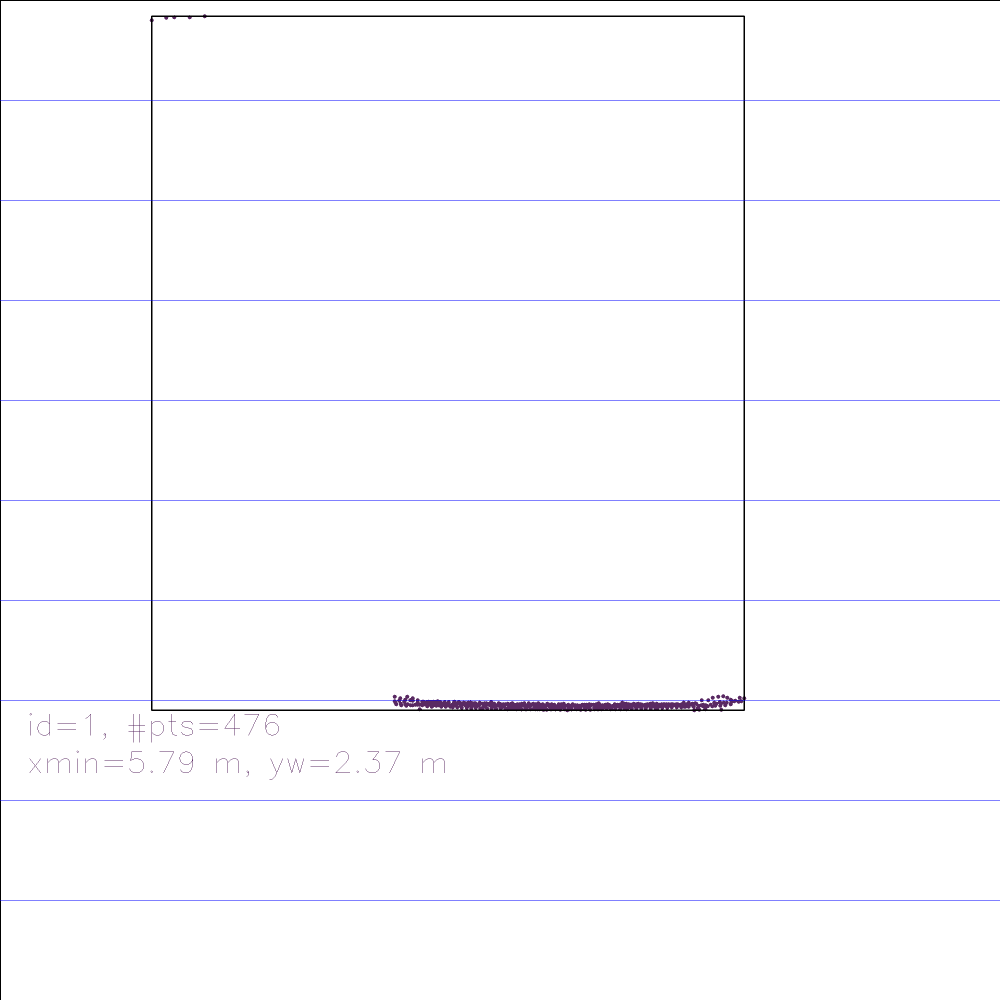
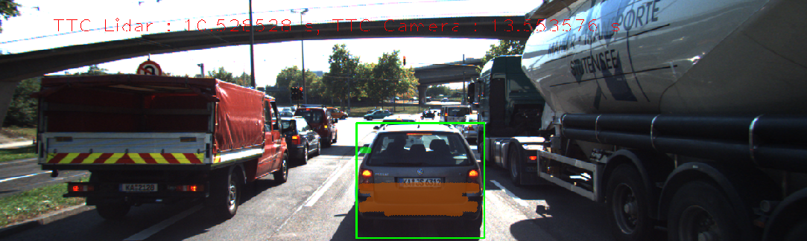
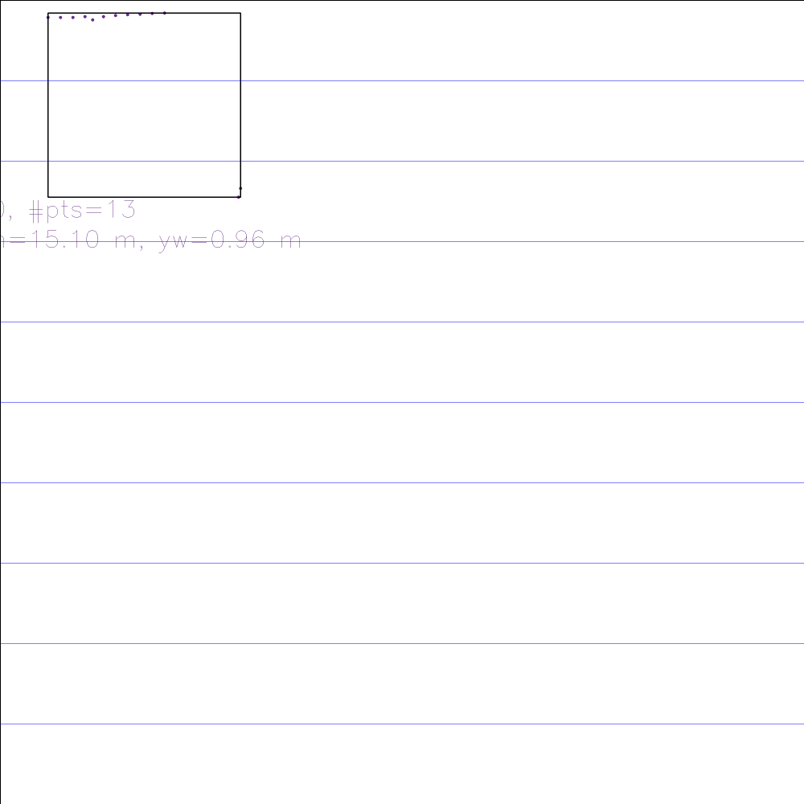
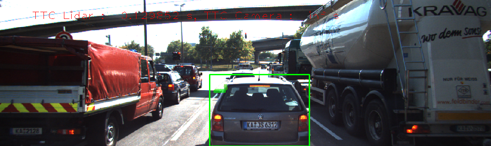
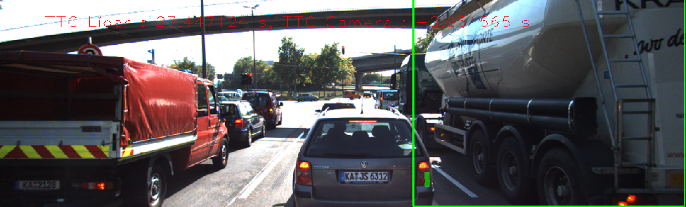

# Track an Object in 3D Space

## FP.0 - 4
- implemented in repository

## FP.5 Performance Evaluation 1

### Find lidar-based TTC detection fault

1. Lidar pointscloud classification

Only clustering lidar points cloud with ROI leads to outlier points into 
TTC calculation. The proper clustering algorithm is needed.

1. Lidar sensing fault

Filtered lidar points with ROI only contains outliers, although all the inlier points are disappeared.
That makes TTC very small value, eventhough the car is stopped in traffic.

## FP.6 Performance Evaluation 2

### Find combination of det/desc combination, and find camera-based TTC fault

1.FAST-BRISK

2.FAST-ORB

3.SHITOMASHI-BRIEF

In some points, bounding box matching goes wrong and camera TTC significantly gets errors.
To handle this problem, more strict matching algorithm should be implemented.
